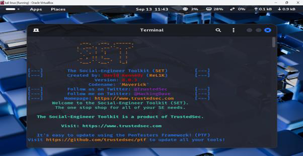
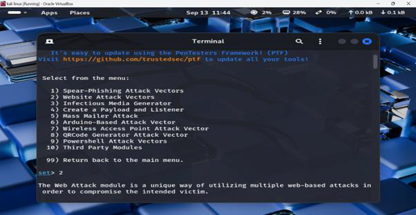
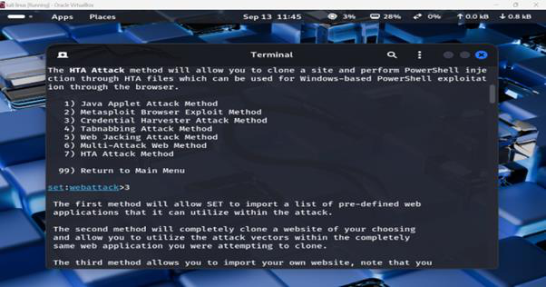
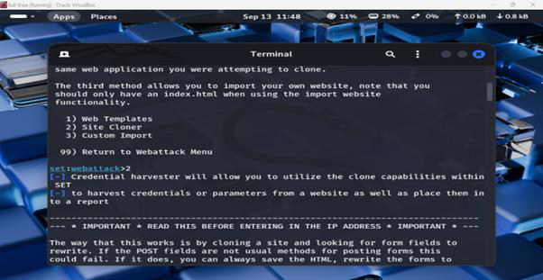
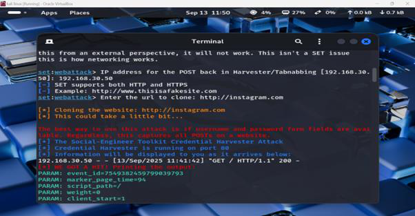
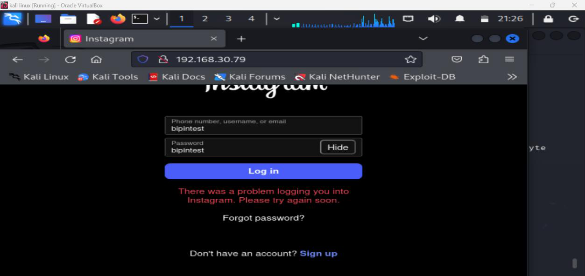
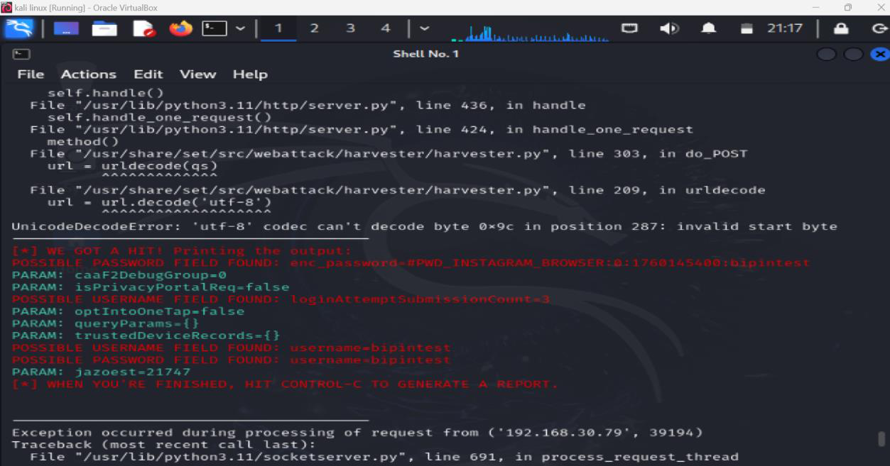

# Lab 1: Social Engineering Attack – Credential Harvester with SET

> **Ethical Hacking Lab | Kali Linux | Social Engineering Toolkit (SET)**  
> Performed in a controlled environment for educational purposes only.

## Overview

This lab demonstrates how a credential harvester phishing attack works using the **Social Engineering Toolkit (SET)** on Kali Linux. The goal is to understand the mechanics of phishing attacks in order to build better defences.

---

## Tools Used

| Tool | Purpose |
|------|---------|
| Kali Linux | Attack platform |
| Social Engineering Toolkit (SET) | Phishing framework |
| SET Credential Harvester | Captures submitted credentials |
| Site Cloner | Clones a real login page |

---

## Attack Walkthrough

### Step 1 – Launch SET and Select Attack Vector

SET was launched from the Kali Linux applications menu. The **Website Attack Vectors** option was selected — a purpose-built module for web-based phishing attacks.

---

### Step 2 – Choose Website Attack Method

From the web attack module, **Credential Harvester Attack Method** was selected. This method intercepts any data submitted via a cloned login form.

---

### Step 3 – Configure the Credential Harvester

The Credential Harvester was configured to listen on the attacker's local IP address. SET was set to clone the target website automatically.

---

### Step 4 – Clone the Target Site

The **Site Cloner** option was used to create a pixel-perfect copy of Instagram's login page. The cloned page was hosted on the attacker's machine and made accessible on the local network.

---

### Step 5 – Host the Phishing Page

The fake Instagram page was hosted at the attacker's local IP address (`192.168.x.x`). To any user on the same network, it appears identical to the real Instagram login.

---

### Step 6 – Victim Visits the Phishing Page

The victim accessed the attacker's IP address from a separate machine. The cloned Instagram login page rendered convincingly.

---

### Step 7 – Credentials Captured

After the victim submitted their credentials, SET's Credential Harvester intercepted and displayed them in plaintext on the attacker's terminal — including username and password.

---

## Key Findings

- Credential harvesting via cloned sites is **highly effective** in local network scenarios
- Victims cannot visually distinguish the fake page from the real one
- Submitted data is captured in **plaintext** with no technical skill required beyond SET setup

---

## Prevention Methods

| Prevention Method | Description | Defence Against Site Cloner |
|---|---|---|
| **Multi-Factor Authentication (MFA)** | Requires a second factor like an app-based code or token | Even if credentials are harvested, login is prevented without the second factor |
| **Password Manager Usage** | Auto-fills passwords only on correctly matched domains | Will not auto-fill on spoofed or IP-based domains, alerting the user |
| **Web Browser Security** | Modern browsers flag insecure sites (HTTP) or untrusted certificates | Users are alerted if the cloned site lacks HTTPS or has invalid certificates |
| **Email Gateway Filtering** | Filters incoming emails for spoofed domains, suspicious URLs, or phishing patterns | Prevents phishing emails from reaching the user in the first place |

---

## Disclaimer

> This lab was conducted in a **controlled, isolated environment** for educational purposes as part of MIT503 Information Security coursework at NAPS. No real credentials were compromised. The techniques demonstrated here should never be used outside of authorized penetration testing engagements.
